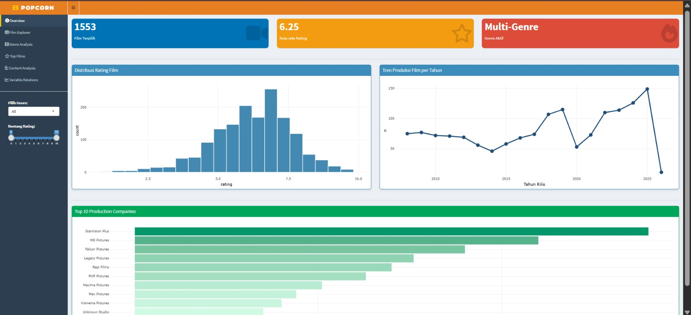
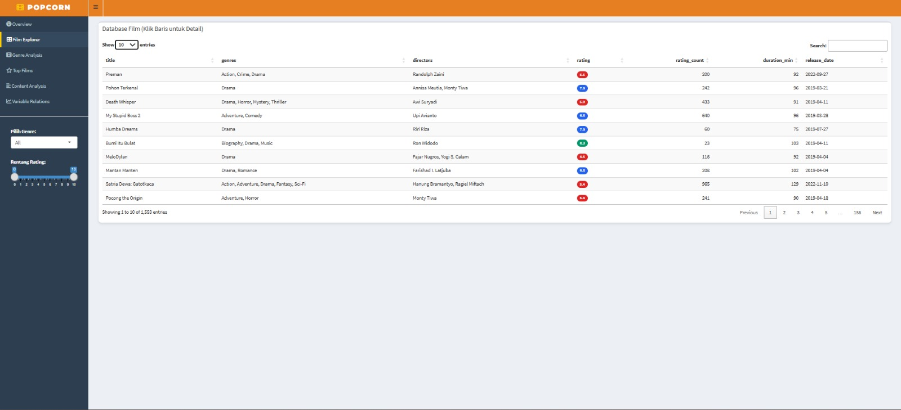
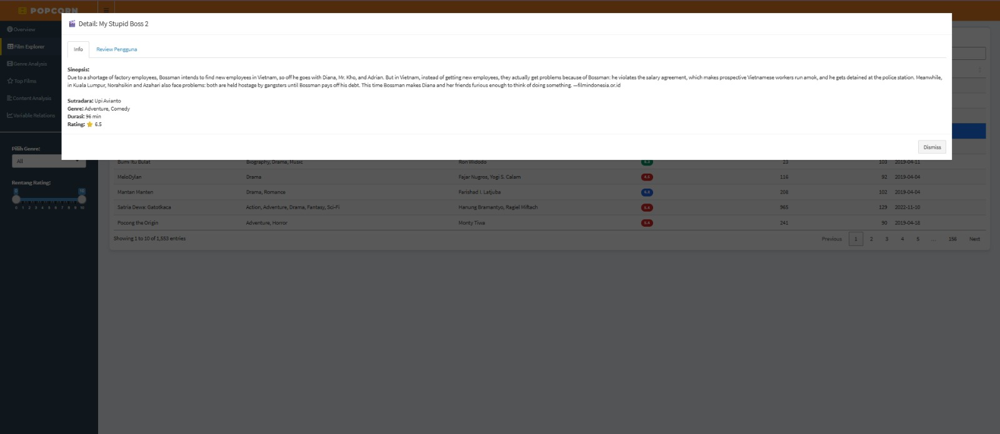
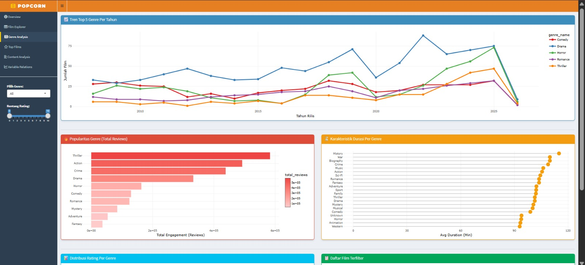
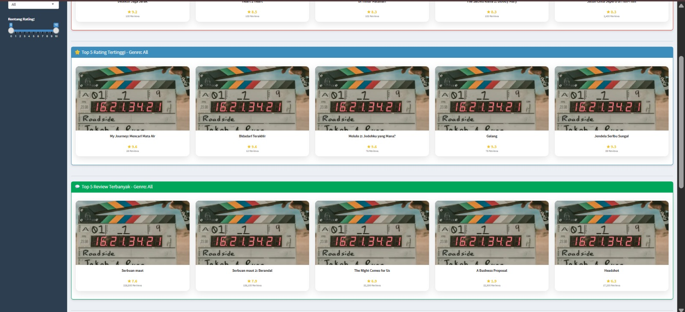
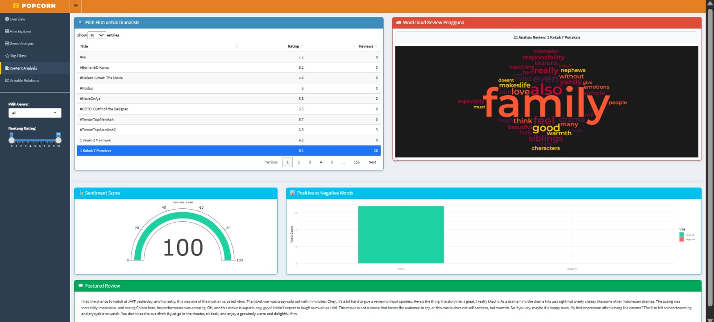
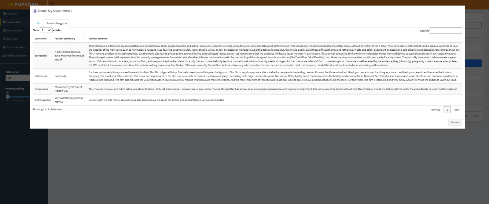
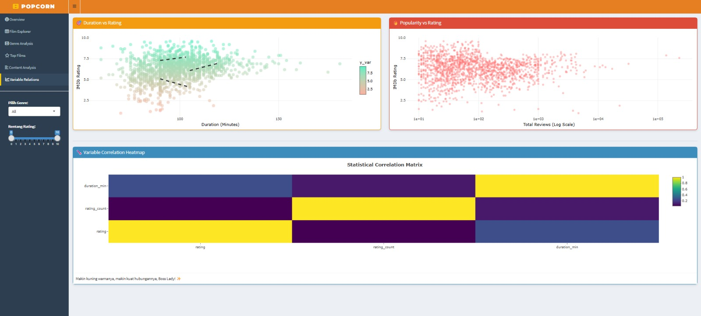
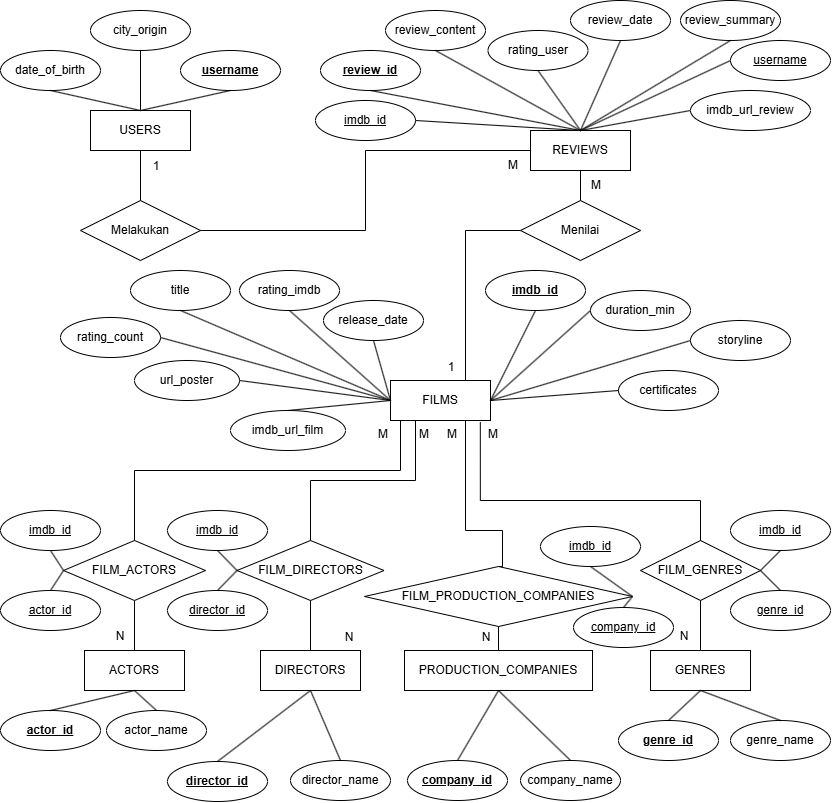

<h1 align="center">🍿 <b>Selamat Datang di POPCORN!</b> 🎬🚀</h1>

<h2 align="center"><i>"Platform Observasi Performa dan Catatan Rating Cinema"</i></h2>

---

## 📑 Menu

- [📌 Informasi](#-informasi)
- [📋 Tentang Project](#-tentang-project)
- [📷 Screenshot Tampilan](#screenshot)
- [💾 Skema Basis Data](#-skema-basis-data)
- [🔗 ERD](#-erd)
- [📜 Dokumentasi Analisis](#-dokumentasi-analisis)
- [📂 Struktur Folder](#-struktur-folder)
- [🛠 Teknologi yang Digunakan](#-teknologi-yang-digunakan)
- [👥 Tim Pengembang](#-tim-pengembang)

---

## 📌 Informasi

**POPCORN** adalah platform analisis data film berbasis **R Shiny** yang dirancang untuk membantu pengguna mengeksplorasi informasi film melalui visualisasi data interaktif.

Dashboard ini memungkinkan pengguna untuk:

- melihat jumlah film dalam database
- melihat rata-rata rating film
- menemukan genre yang paling dominan
- menganalisis tren produksi film berdasarkan tahun rilis
- mengeksplorasi film dengan rating tertinggi
- membaca dokumentasi struktur database dan analisis data

---

## 📋 Tentang Project

Project ini dibuat sebagai bagian dari praktikum **Pemrosesan Data Besar**.

Tujuan utama project ini adalah:

1. Merancang database relasional untuk dataset film
2. Melakukan normalisasi database hingga **Third Normal Form (3NF)**
3. Mengembangkan dashboard interaktif menggunakan **R Shiny**
4. Menyediakan dokumentasi analisis dan struktur database yang mendukung pengambilan insight dari data film

Database yang digunakan mencakup beberapa entitas utama seperti:

- `films`
- `users`
- `reviews`
- `actors`
- `directors`
- `genres`
- `production_companies`

Relasi many-to-many direpresentasikan menggunakan tabel penghubung seperti:

- `film_actors`
- `film_directors`
- `film_genres`
- `film_production_companies`

---

## 📷 Screenshot Tampilan

1.  **Tampilan Menu Utama atau Overview**

    -   Menampilkan jumlah film terpilih, rata-rata rating, dan genre aktif berdasarkan filter.
    -   Menampilkan distribusi rating film dalam bentuk histogram.
    -   Menampilkan tren produksi film per tahun.
    -   Menampilkan daftar perusahaan produksi teratas.

    

2.  **Daftar Film atau Film Explorer**

    -   Pengguna dapat menelusuri film yang tersedia melalui tabel interaktif.
    -   Informasi yang ditampilkan meliputi judul, genre, sutradara, rating, jumlah review, durasi, dan tanggal rilis.
    -   Tersedia fitur pencarian untuk menemukan film dengan cepat.
    -   Pengguna dapat klik salah satu film untuk melihat detail lebih lanjut.

    

3.  **Detail Film**

    -   Menampilkan informasi lengkap dari film yang dipilih.
    -   Informasi yang ditampilkan mencakup sinopsis, sutradara, genre, durasi, dan rating film.
    -   Membantu pengguna memahami isi film secara lebih detail sebelum melihat review.

    

4.  **Tampilan Analisis Genre atau Genre Analysis**

    -   Menampilkan tren top 5 genre per tahun.
    -   Menampilkan popularitas genre berdasarkan total review.
    -   Menampilkan karakteristik durasi rata-rata untuk setiap genre.
    -   Menampilkan distribusi rating film berdasarkan genre.
    -   Menyediakan daftar film hasil filter genre.

    

5.  **Tampilan Film Teratas atau Top Films**

    -   Menampilkan top 5 film global dengan minimal 100 review.
    -   Menampilkan top 5 film dengan rating tertinggi berdasarkan genre.
    -   Menampilkan top 5 film dengan review terbanyak berdasarkan genre.
    -   Membantu pengguna menemukan film terbaik dan paling populer.

    

6.  **Tampilan Content Analysis**

    -   Menampilkan wordcloud review pengguna.
    -   Menampilkan sentiment score.
    -   Menampilkan perbandingan kata positif dan negatif.
    -   Menampilkan featured review untuk film yang dipilih.

    

7.  **Tampilan Review Pengguna**

    -   Menampilkan daftar review pengguna untuk film yang dipilih.
    -   Informasi review mencakup username, ringkasan review, dan isi review.
    -   Membantu pengguna memahami opini penonton terhadap film tersebut.

    

8. **Tampilan Hubungan Antar Variabel atau Variable Relations**

    -   Menampilkan hubungan antara durasi film dan rating.
    -   Menampilkan hubungan antara popularitas film dan rating.
    -   Menampilkan heatmap korelasi antar variabel numerik.
    -   Membantu pengguna memahami pola hubungan antar variabel pada data film.

    
   
## 💾 Skema Basis Data

Database dibangun menggunakan **MySQL** dengan nama basis data:

`db_bioskop`

normalisasi_database.md → penjelasan proses normalisasi hingga 3NF

```sql
CREATE DATABASE IF NOT EXISTS db_bioskop;
USE db_bioskop;
```

Contoh pembuatan tabel `films`:

```sql
CREATE TABLE films (
  imdb_id VARCHAR(20) PRIMARY KEY,
  title VARCHAR(255),
  rating_imdb DOUBLE,
  rating_count INT,
  storyline TEXT,
  certificates TEXT,
  release_date DATE,
  duration_min INT,
  imdb_url_film TEXT,
  url_poster TEXT
);
```

📂 Struktur Folder

`connection/ddl.sql`

---

## 🔗 ERD

ERD (*Entity Relationship Diagram*) menjelaskan hubungan antar entitas dalam database Dashboard Film.



Relasi utama dalam database ini meliputi:

| Hubungan | Penjelasan |
|---|---|
| Film → Review (1:N) | Satu film dapat memiliki banyak review |
| User → Review (1:N) | Satu user dapat memberikan banyak review |
| Film → Actor (M:N) | Satu film dapat memiliki banyak aktor |
| Film → Director (M:N) | Satu film dapat memiliki lebih dari satu sutradara |
| Film → Genre (M:N) | Satu film dapat memiliki lebih dari satu genre |
| Film → Production Company (M:N) | Satu film dapat diproduksi oleh lebih dari satu perusahaan |

---

## 📜 Dokumentasi Analisis

Dokumentasi yang mendukung project ini tersedia pada folder `doc/`, yaitu:

- `pembahasan.md` → pembahasan umum project Dashboard Film
- `data_dictionary.md` → penjelasan struktur tabel dan atribut database
- `normalisasi_database.md` → penjelasan proses normalisasi hingga 3NF
- `analisis_dashboard.md` → pembahasan KPI dan analisis dashboard
- `kpi_dashboard.md` → definisi KPI utama yang digunakan dalam dashboard

Dokumentasi ini dibuat untuk memastikan bahwa struktur database, analisis, dan dashboard saling konsisten.

---

## 📂 Struktur Folder

```text
Dashboard-Film/
│
├── app/                         # Kode aplikasi dashboard R Shiny
│   ├── app.R
│   ├── ui.R
│   └── server.R
│
├── connection/                  # Koneksi database dan query SQL
│   ├── db_connection.R
│   ├── ddl.sql
│   └── queries.sql
│
├── etl/                         # Proses ETL data
│   ├── 01_load_raw_to_db.R
│   ├── 02_etl_clean_to_csv.R
│   └── 03_load_processed_to_db.R
│
├── data/
│   ├── raw/                     # Data mentah
│   └── clean/                   # Data hasil pembersihan
│
├── doc/                         # Dokumentasi project
│   ├── ERD.png
│   ├── analisis_dashboard.md
│   ├── data_dictionary.md
│   ├── kpi_dashboard.md
│   ├── normalisasi_database.md
│   └── pembahasan.md
│
├── images/                      # Gambar pendukung project
│
└── README.md
```

---

## 🛠 Teknologi yang Digunakan

- **R Shiny** – framework untuk membangun dashboard interaktif
- **MySQL** – sistem manajemen basis data
- **DBI / RMySQL** – koneksi database dari R
- **tidyverse** – manipulasi data
- **ggplot2** – visualisasi data
- **Plotly** – grafik interaktif

---

## 👥 Tim Pengembang

- **Database Manager: Lilik Avitadia Prichanti (M0501251031)**  
  Bertanggung jawab dalam perancangan struktur database, DDL, dan pengelolaan integritas data.

- **Backend Developer: Sigap Abror Falah (M0501251013)**  
  Bertanggung jawab dalam integrasi query database dengan dashboard serta logika server.

- **Frontend Developer: Nur Aulia Maknunah (M0501251009)**  
  Bertanggung jawab dalam membangun tampilan dashboard yang interaktif dan mudah digunakan.

- **Data Analyst: Arnedi Rizki Adidharma (M0501251040)**  
  Bertanggung jawab dalam dokumentasi analisis, pembahasan database, definisi KPI, serta validasi konsistensi antara dashboard dan database.
  
---

## 📜 Lisensi

Project **POPCORN** dibuat sebagai bagian dari praktikum **Pemrosesan Data Besar**.
